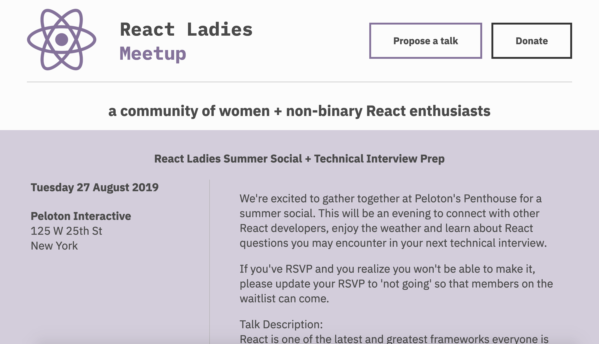

# React-Ladies
[](https://app.netlify.com/sites/reactladies/deploys)

We're a group of women and non-binary ReactJS enthusiasts in New York City (and beyond).



## Installation

Install the dependencies:

### `yarn install`

### Set API key in environment

   Add `MEETUP_API_KEY` env variable from here: https://secure.meetup.com/meetup_api/key/. Do not commit this value to GitHub.

Run the development server:

### `gatsby develop`

This website is based off of [gatsby-theme-meetup](https://github.com/matthieuauger/gatsby-theme-meetup). For more information about how to edit content view their README. **tldr;** the files that should be edited are:

```src/@matthieuauger/gatsby-theme-meetup/components
src/@matthieuauger/gatsby-theme-meetup/pages
src/@matthieuauger/gatsby-theme-meetup/images
src/text-blocks
```


# Credit

Monica Powell edited this website. Addt'l contributors are welcome :-)
